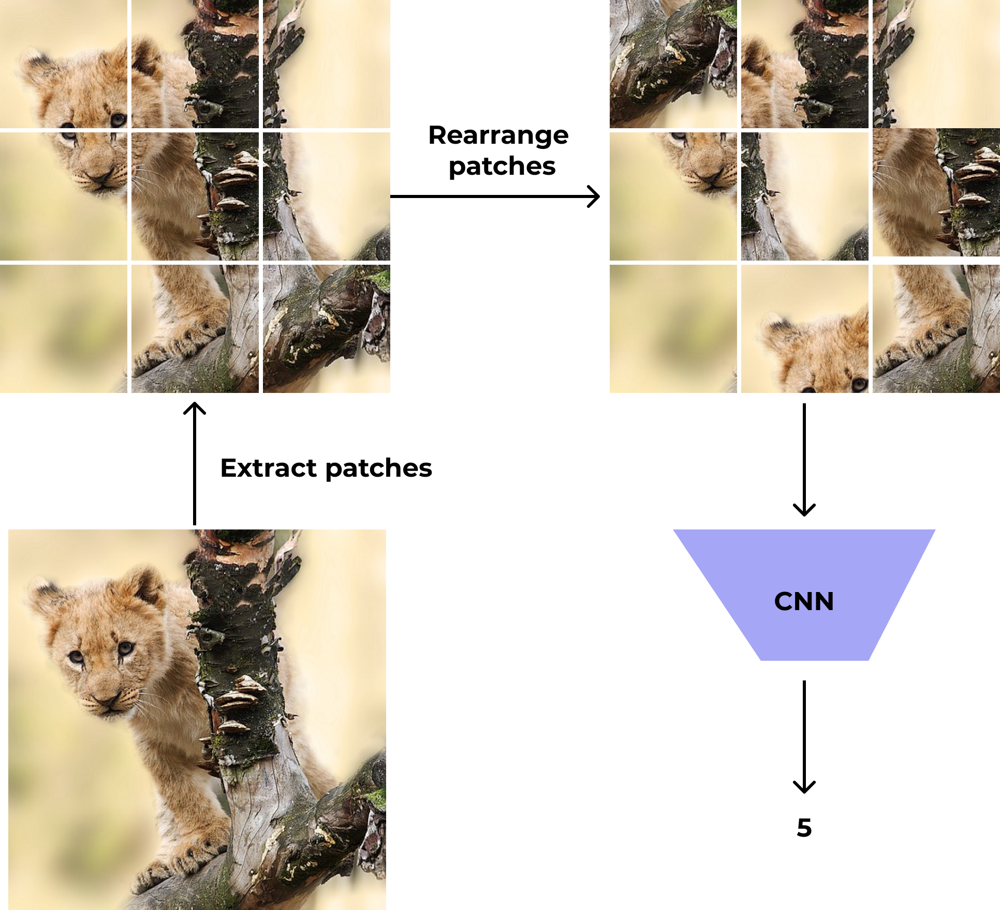
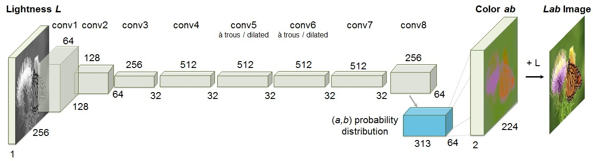

Deep learning has proved to be very effective in computer vision problems. Neural network these days can even [surpass human level accuracy in some tasks](https://arxiv.org/pdf/1706.06969.pdf). Most of these networks use CNN(convolutional neural network) as their basic structure. The performance of these CNNs depends on:  

- Their capability i.e the architecture
- The amount of labelled training data

Today, we have good architectures like VGG, ResNet, DenseNet, GoogLeNet, etc. that can learn complex representations or features in an image. However, to get the best out of these complex architectures we need to train them with a huge amount of labelled data.  For instance, these networks are trained on the **imagenet dataset which consists of 14 million images** belonging to 1000 different classes. But, getting such huge labelled dataset is not feasible for all tasks. So, the question still remains.

## How can we effectively train CNNs with small amount of labelled data?

One solution to this problem is [transfer learning](https://en.wikipedia.org/wiki/Transfer_learning).

> **Transfer learning (TL)** is a research problem in [machine learning](https://en.wikipedia.org/wiki/Machine_learning) (ML) that focuses on storing knowledge gained while solving one problem and applying it to a different but related problem.
>
> -- wikipedia

Using transfer learning we can re-train a model trained to solve one problem, also called pretrained model, to solve another similar problem. For example, we can use a model trained to classify plant leaves and re-train it to classify plant diseases. But, the problem with this approach is, we may not find a good pretrained model for the task we are trying to perform. Let's say we want do some domain specific or novel task like segmenting specific region from brain CT scan images, then it is hard to find a good(or any)  pre-trained model that we can use for this task. What do we do in such cases? **The answer is, we can leverage self supervised technique to learn useful features from unlabelled data**.

## Self supervised learning

On comparing labelled data with unlabelled data on the internet, we will find that, the proportion of unlabelled data is much higher than that of labelled data. 

**Self supervised learning is a technique that allows us to use the unlabelled data present in the internet or our local devices to train our models in order to learn features**. 

Before formally defining self supervised learning, let's define some terminologies.

- **Pretext Task**   

  Pretext task is a dummy task on which a networks is trained to learn useful features. The pretext task uses pseudo labels for training.

- **Downstream Task**

  Downstream task is the actual task that we want to train and evaluate our model on. When we have scarce labelled data, the downstream task will benefit from the features learned while training for the pretext task. The downstream task requires labelled data for training.  

- **Pseudo Label**

  Pseudo label are the automatically generated labels based on data attributes for pretext tasks. It is important to note that these are not human generated labels.

Self supervised learning is the subset of unsupervised learning. It is the method in which a neural network is trained using pseudo label to solve the pretext task. While solving the pretext task, the network learns features. This network is finally trained on human labelled data to solve the downstream task.

Below, we will discuss some common pretext and downstream task used for self supervised learning in computer vision. 

## Common pretext tasks used for self supervised learning

Now, let's look at some common pretext task used in computer vision.

### [Solving Jigsaw Puzzle](https://arxiv.org/pdf/1603.09246.pdf)

In this method, 9 different fixed-size patches from an image are extracted. These patches are then sent to a function which rearranges them in any one of **k** different permutations. The number of permutations,**k**, is fixed and is $$<<$$ **9!**(i.e the total number of possible rearrangements that can be done with 9 patches). Each permuation has a corresponding label attached to it. The rearranged images are sent to a CNN which is trained to predict the corresponding label.

This network trained to solve the jigsaw puzzle as a prpetext can then be used for training image segmentation or image classification model as a downstream task.

### [Image Colorization](https://arxiv.org/pdf/1603.08511.pdf)

Image colorization refers to predicting the colorized version of the grayscale image.

In this task, the network is trained to predict the colored version of the grayscale images. Getting dataset for this task is fairly easy. We can download RGB images from the internet and then convert them to their grayscale version. 

To sensibly colorize the the grayscale image, the network needs to recognize unique objects within an image, different parts within an object, and group pixels of the same part together. This complexity of image colorization forces network to learn useful visual features which can then be used for solving the downstream tasks. 

Image colorization can be performed by employing GAN or an encoder-decoder based CNN. A simple architecture for encoder-decoder based CNN is shown below.

image credits: <a href = "https://arxiv.org/pdf/1603.08511.pdf">Colorful image colorization</a>

### [Context/Relative Position prediction](https://arxiv.org/pdf/1505.05192.pdf)

Context prediction is the task of predicting relative position of an image patch with respect to another patch from the same patch. 

image credits: <a href = "https://arxiv.org/pdf/1505.05192.pdf">Unsupervised Visual Representation Learning by Context Prediction</a>

The above image shows the data generation process for context prediction. We extract a patch(blue bordered) from an image. We then take another patch from the image(red bordered). This second patch can be taken from any one of 8 different locations(top left, top center, top right, center left, ...bottom right) with respect to the first patch. Depending upon the position of the second patch, a numerical label, from 1 to 8, is generated for the pair of patches. Finally, a CNN is trained to predict the relative position of the image patches.

For the network to do well in this task, it needs to learn to recognize object and their parts. Experiments have shown that a network initially trained using such unsupervised technique then on the downstream task perform better than a network trained solely on the dataset for the actual downstream task.

## References

1. [Self-supervised Visual Feature Learning with Deep Neural Networks: A Survey, Jing et al.](https://arxiv.org/abs/1902.06162)
2. [Unsupervised Learning of Visual Representations by Solving Jigsaw Puzzles, Noroozi et al.](https://arxiv.org/pdf/1603.09246.pdf)
3. [Colorful Image Colorization, Zhang et. al.](https://arxiv.org/pdf/1603.08511.pdf)
4. [Unsupervised Visual Representation Learning by Context Prediction](https://arxiv.org/pdf/1505.05192.pdf)

