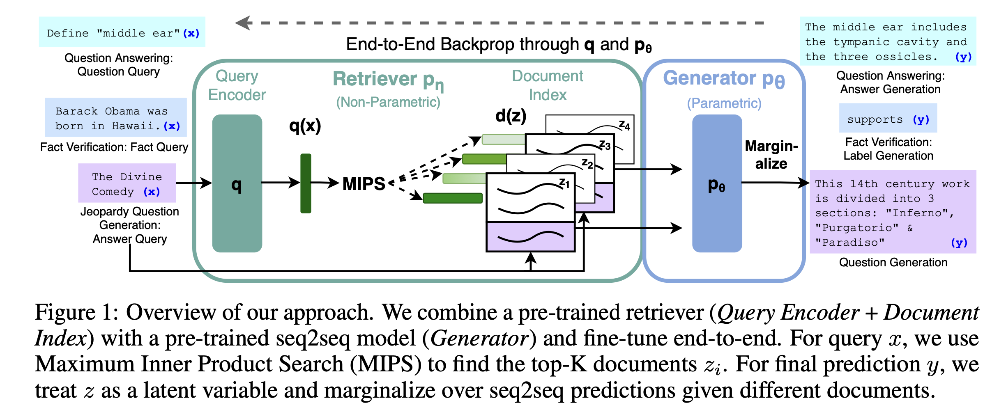
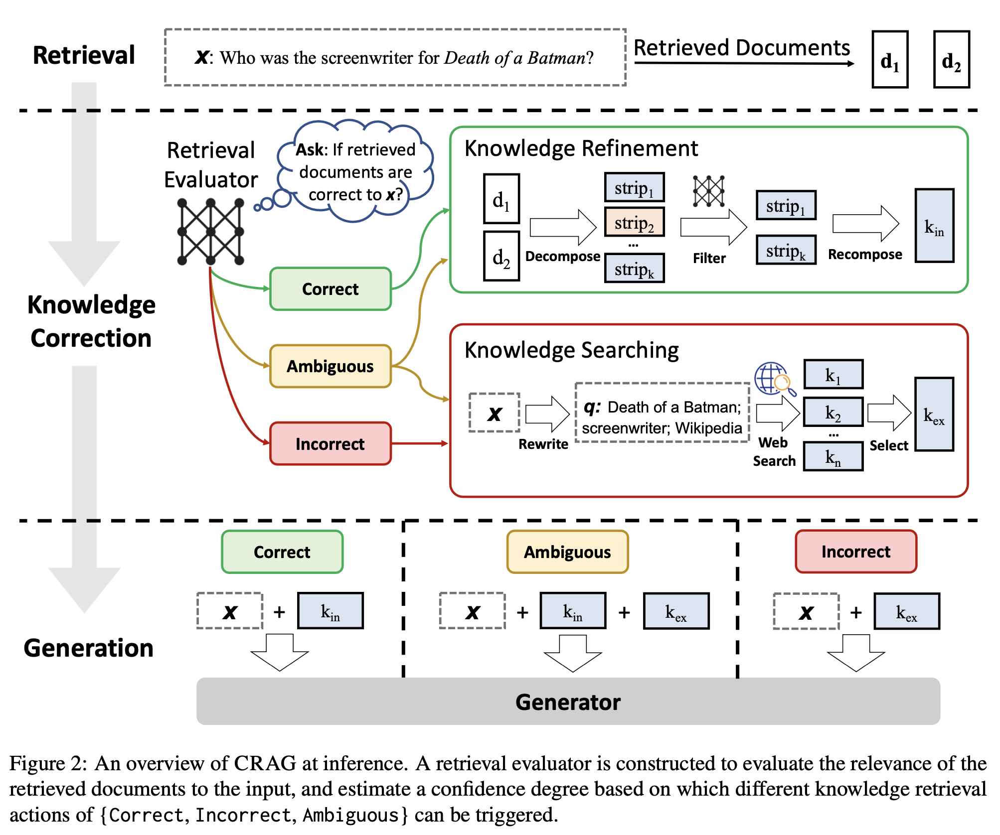

The recent advancement in Generative AI and release of ChatGPT shook the world to its core, inciting both excitement and fear for the future. The advancement in artificial intelligence and capabilities of LLMs have made headlines ever since. But, soon after its release, people began exposing its flaws. Often, the 175 billion parameter natural language processing model would fail provide its users with relevant responses. It frequently provided incorrect answers to questions even a kid could solve. Furthermore, it was much easier to trigger an incorrect response. For instance, if you asked the model “What is 3 + 2?” and the model responded with 5 as the answer, you could just tell the model it is 6 and the model would agree. Misinformation is another problem with these large language models(LLMs). Recently, [Air Canada had to pay a hefty fine](https://www.bbc.com/travel/article/20240222-air-canada-chatbot-misinformation-what-travellers-should-know) because its chatbot provided false information regarding its refund policy to its traveller. This phenomenon where a LLM generates nonsensical or inaccurate information to user query is called hallucination.

Numerous researchers and research labs have concentrated their efforts on solving the hallucination problem in LLMs. As such, we have a few methods that help to minimize hallucination to some degree. They are:

- Prompt Engineering
- Iterative Querying
- Retrieval Augmented Generation

In this article, we will narrow our attention to the third method: **Retrieval Augmented Generation**.

## Retrieval Augmented Generation

[Retrieval Augmented Generation](https://arxiv.org/pdf/2005.11401) or RAG, was introduced by Facebook AI research(or Meta AI) labs in 2021. Without RAG, a user would ask a LLM to generate some answers for a query and the generated response could be outdated or factually incorrect. With RAG, instead of just providing the user’s question/query, we also feed the model with additional relevant documents, in vector databases, to search for the answer. The process involves the following steps:

1. Get a query from the user
2. Find documents in the corpus that are similar to the provided query(semantic search using embeddings from pre-trained model)
3. Pass the documents as context to generate an answer for the user’s query



*(Image Credits: [Retrieval-Augmented Generation for Knowledge-Intensive NLP Tasks](https://arxiv.org/pdf/2005.11401))* 

By restricting the model to search for answers in the provided context documents, we encourage the model to generate informed responses relevant to our knowledge base and user prompt. This results in more accurate responses than using a standalone LLM but there are a few issues:

* What happens if the retrieved documents are irrelevant to the user's query? For instance, the user could be asking about Henry Ford and the retriever uses documents related to Ford(the car manufacturer). In this case, the LLM would still provide inaccurate response.
* What happens if the knowledge base doesn’t contain answers to the user’s query? In this case, the LLM simply replies with something like “<key entity> is not mentioned in the provided context”. 

**How can we overcome these issues? Well, the answer is by implementing Corrective Retrieval Augmented Generation.**


## Corrective Retrieval Augmented Generation

As you might have noticed, the quality of output generated by RAG models is highly dependent on the quality of retrieved documents from the external knowledge bases. The quality of results then follows the GIGO(Garbage In Garbage Out) principle. Low quality of retrieved documents yields low-quality output. To combat this challenge, Yan et. al. proposed [Corrective Retrieval Augmented Generation](https://arxiv.org/pdf/2401.15884)(CRAG) as an improvement over RAG model. CRAG implements a lightweight retrieval evaluator that quantifies the relevance of retrieved documents with respect to the specific query(or original prompt). Depending upon the confidence score, the documents are labeled as correct, ambiguous, or incorrect and corresponding action is triggered.

### Correct action
If the correct action is triggered, meaning the retrieved document from the vector database is highly relevant to the query, a knowledge refine method kicks in to extract the most critical bits of knowledge in the retrieved document

### Incorrect action
If incorrect action is triggered, the retrieved documents from the vector database are discarded and results from the external sources(web search) are treated as complementary sources of knowledge.

### Ambiguous action
If the ambiguous action is triggered, CRAG takes a rather soft and balanced approach. It combines the strategies used in correct and incorrect action i.e. both web searches and the knowledge from the retrieved document is used.

The flowchart below provides a visual representation of the above process:

*(Image Credits: [Corrective Retrieval Augmented Generation](https://arxiv.org/pdf/2401.15884))* 

Now, let’s implement CRAG in Python using LlamaIndex.

### CRAG in python using llma_index

Before we start the implementation, we need to:

* Get the OpenAI API keys from [this site](https://platform.openai.com/api-keys). We will be using the GPT-4 model as a relevancy evaluator to extract relevant documents.
* Get the [Tavily AI API](https://tavily.com/#api) keys. We will be using Tavily AI for web searches(when our local data corpus doesn’t contain answers to the queries).
* Download the text files from [this repository](https://github.com/bhattbhuwan13/data-files/tree/main/data) and store them in the local directory named data. You can also find the complete code in the same repository.

Now, we are ready to implement the model. We will be using llama_index and a few other libraries to implement the model so let’s install them.

```
pip install llama-index-llms-openai llama-index-tools-tavily-research llama-index-embeddings-openai
pip install llama-index-packs-corrective-rag
pip install llama-index-readers-file
```


Let’s set up the api keys,


```python
TAVILY_API_KEY = 'YOUR API KEY'
OPENAI_API_KEY = 'YOUR API KEY'
import os
os.environ["OPENAI_API_KEY"] = OPENAI_API_KEY
```


Now, we will load our local documents and instantiate a CorrectiveRAG using `CorrectiveRAGPack` from `llama_index`.

```python
from llama_index.core import SimpleDirectoryReader
from llama_index.packs.corrective_rag import 
CorrectiveRAGPackdocuments = SimpleDirectoryReader("data").load_data()
corrective_rag_pack = CorrectiveRAGPack(documents, tavily_ai_apikey=TAVILY_API_KEY)
```


Now, we are ready to query our LLM model. The data folders contains text files with information about the Nobel prize. Let’s ask the model about the prizes.

```
response = corrective_rag_pack.run("Who started nobel prize?")
print(response)

---------OUTPUT---------
Alfred Nobel started the Nobel Prize.
```


The model correctly answers our query. What happens if we ask about information not contained in the documents? Let’s find out:

```
response = corrective_rag_pack.run("What is a grammy award?")
print(response)

---------OUTPUT---------
A Grammy Award is an accolade given by the National Academy of Recording Arts and Sciences for outstanding achievements in the music industry.
```


The model uses web search to come up with the correct answer. It is important to note that if the web search returns an empty response, we will get an empty response back from the model. 

## Evaluation

We are now ready to evaluate the performance of our model. The actual implementation is out of scope for this article, but you will get a general idea. We can use semantic similarity to gauge the performance of our model. To implement it, we need a dataset containing questions and desired responses. We can then get the model response by passing the questions/queries to the model. In the end, we can use any language model to compute the embeddings of the desired response and model response and compute their cosine similarity. A high value of cosine similarity indicates that the generated response and desired response are a close match.

## Conclusion

LLMs are susceptible to hallucinations and hence using them could result in the spread of misinformation, bad user experience and in some cases lawsuits and fines. However, this doesn’t mean you cannot control the model’s output. As discussed in the article, you can use RAG and CRAG to control a model’s response to a user's query by improving the retrieval component. If you want more observability and deploy a rigorously evaluated model/Chatbot to ensure a reliable operation, Literal AI is at your service. We offer a free starter package as well. If you want to know more about the product or have any queries, feel free to contact us. 


